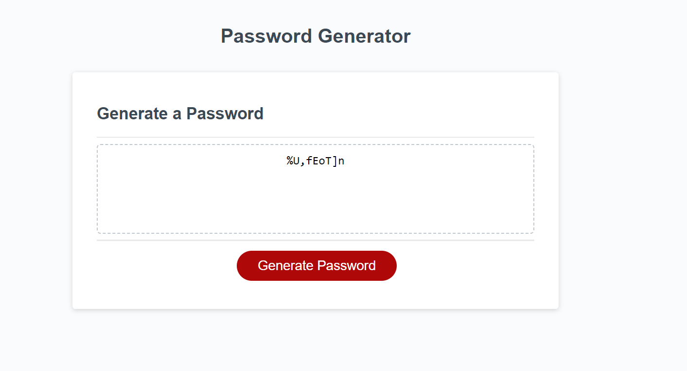

#Password Generator

This project was created for the purpose of creating a random password for the user that will help keep their passwords secure.

## Table of Contents

- [Getting Started](#getting-started)
- [Password.Generator screenshot](#Password.Generator-screenshot)

## Getting Started

The HTML and the CSS was already provided to us by the starter code. we were instructed with adding the JavaScript code to ensure the password generator worked. we started with defining the variables (special characters, upper/lowercase characters and numeric characters) then we had to create functions. first function we created essentially prompted the user to select the number of characters they would like in their password. The second function was to generate a password with if statements asking the user what kind of character they would like their code to have. then we added Math.random and Math.floor in a for loop to essentially tell the code to randomly pick the characters based on the functions rules listed above. then we created one last funtion to basically display our function. 

;